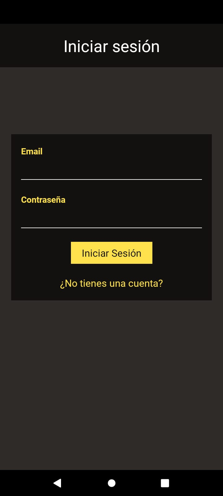
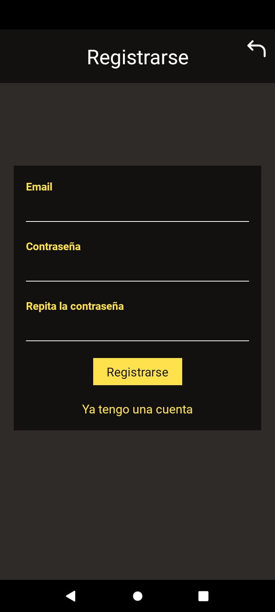
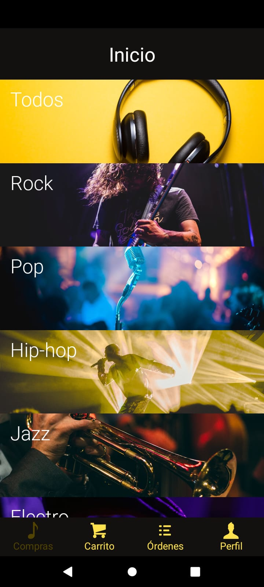
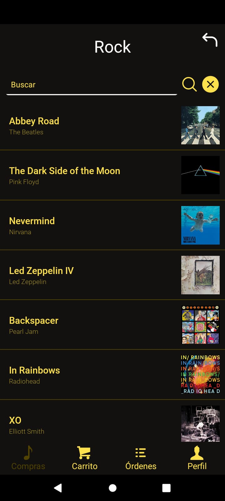
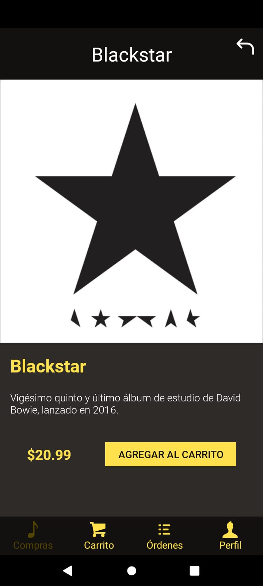
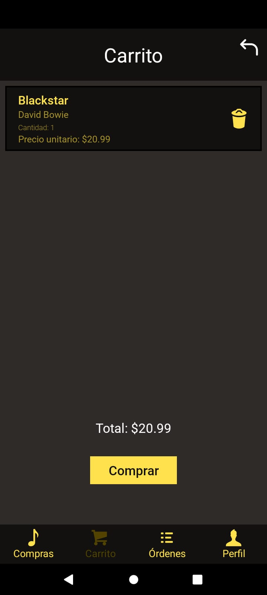
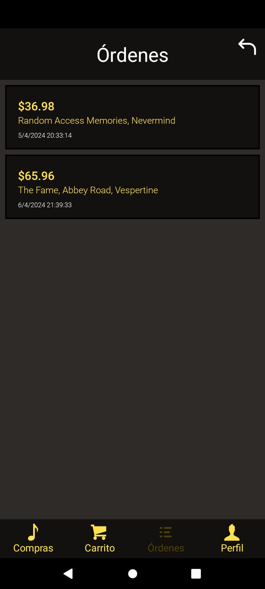
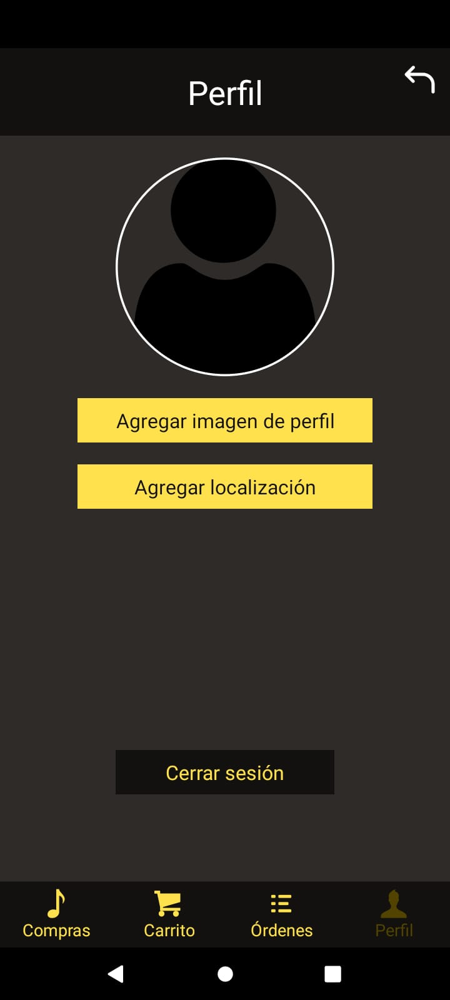

# CD-Commerce App

Aplicación móvil de comercio electrónico desarrollada con React Native para comprar fácilmente tus discos favoritos. 

## Autenticación

### Inicio de sesión



- Solamente los usuarios registrados pueden acceder a las funciones de compra.
- Para acceder, se debe colocar el mail y la contraseña con la que se registró el usuario.
- En caso de no tener una cuenta, se puede acceder fácilmente a la pestaña de registro.

### Registro



- Para registrarse se debe colocar una dirección de correo electrónico y una contraseña.
- La contraseña debe tener al menos 8 caracteres y se debe confirmar.

## E-Commerce

### Compras



- En la pantalla de inicio observamos los distintos géneros para buscar discos fácilmente.
- También está la opción de buscar entre todos los géneros.



- Despliegue de los discos que corresponden al género seleccionado.



- Información del disco seleccionado y precio.
- Para agregar el producto al carrito bastará con presionar un botón.

### Carrito



- En esta pestaña se desplegarán todos los productos que existen en el carrito, su cantidad y su precio.
- Veremos el precio total de la compra y hay un botón para finalizar compra y proceder al pago.

### Órdenes



- Acá se observan las órdenes ya listas, con los productos contenidos y la fecha en que se realizó.

## Perfil



- En esta pestaña veremos información del usuario: su foto de perfil y su ubicación.
- Para cambiar o agregar estos valores, debemos dar autorización a la app.

## Instalación

1. Clona el repositorio:
 ``` git clone https://github.com/renzodemarco/desarrollo-de-apps.git ```
2. Instala las dependencias:
 ```npm install```
3. Configura las credenciales de Firebase en tu proyecto.
4. Ejecuta la aplicación: 
```npm start```

## Tecnologías utilizadas

- **Redux:** Maneja y modifica estados globales.
- **Firebase Realtime Database:** Realiza operaciones de lectura/escritura en la base de datos.
- **Firebase Authentication:** Sistema de autenticación para gestionar la seguridad de la aplicación.
- **React Native Navigation Stack:** Gestiona la navegación entre pantallas.
- **Expo-Location:** Permite acceder y modificar la ubicación del usuario.
- **Expo-Picker-Image:** Permite acceder y subir imágenes desde el dispositivo.

## Contacto

Para preguntas o soporte, contacta a renzo11demarco@gmail.com.